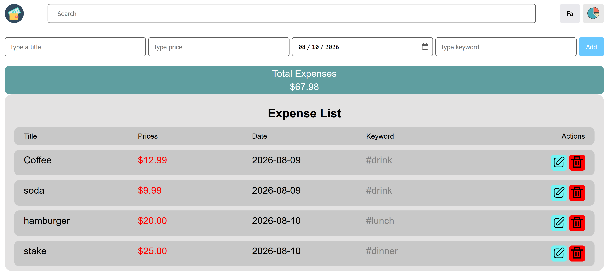
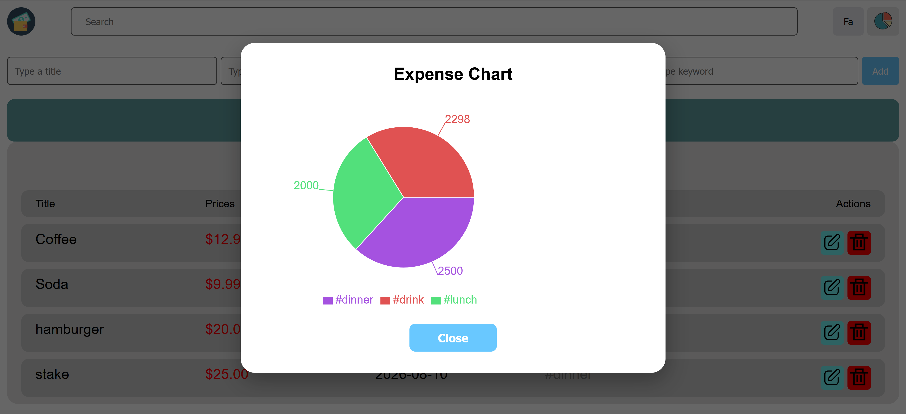
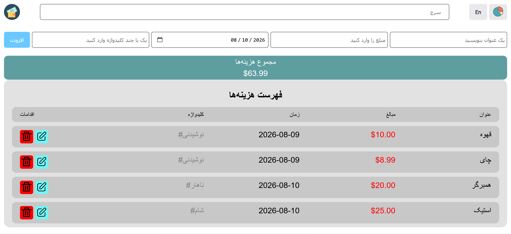
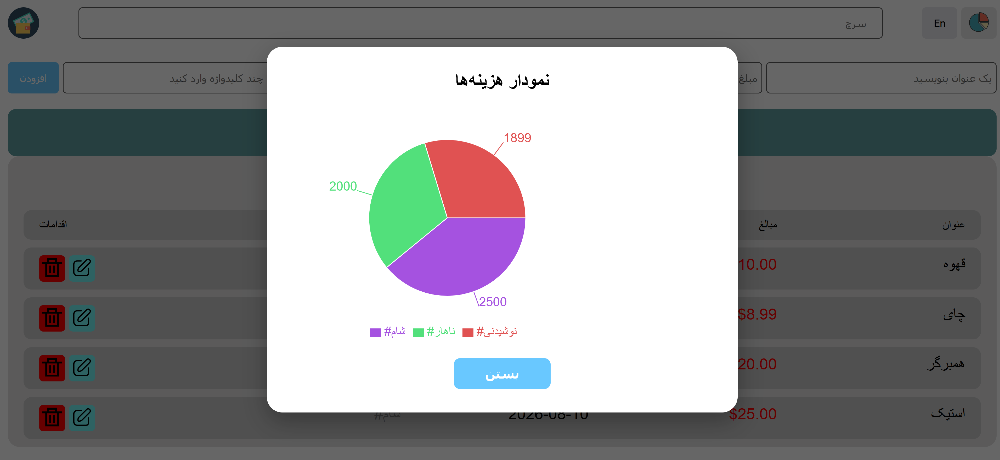

<h1 align="center">💰 Expense Tracker</h1>

<p align="center">
  
  
  
  
  
  
</p>

A modern and responsive expense tracking application built with **React**.

The application allows users to manage their daily expenses, search through them, edit or delete existing expenses, visualize spending with a pie chart, and persist their data using `localStorage`.

It also supports **English and Persian languages** with full **LTR/RTL layout support**.

---

## ✨ Features

* ➕ **Add Expenses**

  * Add an expense with:

    * Title
    * Price
    * Date
    * Keywords
  * Keywords are automatically converted to hashtags.

* ✏️ **Edit Expenses**

  * Edit an existing expense directly inside the expense list.
  * Update title, price, date, and keywords.

* 🗑️ **Delete Expenses**

  * Remove expenses from the list with a single click.

* 🔍 **Search**

  * Search expenses by title or keyword.
  * Search results update instantly while typing.

* 💾 **Persistent Storage**

  * Expenses are automatically saved to the browser's `localStorage`.
  * Data remains available after refreshing or reopening the page.
  * `localStorage` errors are handled with toast notifications.

* 💰 **Total Expenses**

  * Automatically calculates and displays the total amount of all expenses.

* 📊 **Expense Pie Chart**

  * Visualizes expenses based on keywords.
  * Each keyword is displayed as a separate slice.
  * Chart colors are generated dynamically.
  * Displays a tooltip and legend for better readability.

* 🌐 **Bilingual Support**

  * English 🇬🇧
  * Persian 🇮🇷
  * Switch between languages using the language button.

* ↔️ **RTL / LTR Support**

  * Persian uses a right-to-left layout.
  * English uses a left-to-right layout.

* 📱 **Responsive Design**

  * Designed to work across different screen sizes.

* 🔔 **Toast Notifications**

  * User-friendly error messages using `react-toastify`.

---

## 🛠️ Tech Stack

* **React** – UI library
* **Vite** – Development environment and build tool
* **JavaScript (ES6+)** – Application logic
* **CSS** – Styling and responsive layouts
* **Day.js** – Date handling
* **Recharts** – Pie chart visualization
* **React Toastify** – Toast notifications
* **localStorage** – Client-side data persistence
* **Vitest** – Testing framework
* **React Testing Library** – Component and user interaction testing
* **userEvent** – Simulating realistic user interactions

---

## 🧪 Testing

The application is tested using **Vitest**, **React Testing Library**, and **userEvent**.

The tests cover:

### `HomePage.test.jsx`

* Rendering the initial UI.
* Switching between English and Persian.
* Adding expenses.
* Editing expenses.
* Deleting expenses.
* Searching expenses by title.
* Verifying expense data in `localStorage`.
* Verifying that edited expenses are correctly saved to `localStorage`.
* Verifying that deleted expenses are removed from `localStorage`.

### `money.test.js`

The `formatMoney()` utility is tested for:

* Formatting zero values.
* Formatting monetary values with cents.
* Rounding monetary values.
* Formatting large numbers.

### Run Tests

Run the test suite with:

```bash
npm test
```

---

## 📦 Installation

### 1. Clone the repository

```bash
git clone https://github.com/mahdi911110/expense-tracker.git
cd expense-tracker
```

### 2. Install dependencies

```bash
npm install
```

### 3. Start the development server

```bash
npm run dev
```

### 4. Open the application

Open the local development URL shown by Vite, usually:

```text
http://localhost:5173
```

---

## 📁 Project Structure

```text
expense-tracker/
│
├── public/
│   ├── money-wallet.svg
│   ├── edit.svg
│   ├── save.svg
│   ├── delete.svg
│   ├── chart-pie-2.svg
│   └── expense-report.svg
│
├── screenshots/
│   ├── home-en.png
│   ├── chart-en.png
│   ├── home-fa.png
│   └── chart-fa.png
│
├── src/
│   ├── components/
│   │   ├── HomePage.jsx
│   │   ├── HomePage.css
│   │   ├── HomePage.test.jsx
│   │   ├── ExpenseItems.jsx
│   │   ├── ExpenseItems.css
│   │   ├── ExpenseChart.jsx
│   │   └── ExpenseChart.css
│   │
│   ├── utils/
│   │   ├── money.js
│   │   └── money.test.js
│   │
│   ├── App.jsx
│   ├── App.css
│   ├── main.jsx
│   └── index.css
│
├── .gitignore
├── package.json
└── README.md
```

---

## 🧩 Components

### `HomePage.jsx`

The main component of the application.

Responsibilities include:

* Managing the expense list.
* Adding new expenses.
* Deleting expenses.
* Searching expenses.
* Calculating total expenses.
* Switching between English and Persian.
* Managing the chart modal.
* Saving expenses to `localStorage`.
* Handling `localStorage` errors.

---

### `ExpenseItems.jsx`

Responsible for rendering an individual expense.

Features include:

* Displaying expense information.
* Inline editing.
* Updating expense information.
* Deleting an expense.
* Supporting both Persian RTL and English LTR layouts.

---

### `ExpenseChart.jsx`

Responsible for displaying the expense visualization.

The component:

* Groups expenses by keyword.
* Calculates the total amount for each keyword.
* Uses **Recharts** to render a pie chart.
* Generates different colors for chart slices.
* Displays a tooltip and legend.
* Shows an appropriate message when there are no expenses.

---

### `money.js`

Contains the `formatMoney()` utility function used to format expense amounts as currency.

---

## 🌐 Language Support

The application supports two languages:

### 🇬🇧 English

Uses a left-to-right layout:

```text
LTR
```

### 🇮🇷 Persian

Uses a right-to-left layout:

```text
RTL
```

The language can be changed using the **En / Fa** button in the header.

The interface updates dynamically, including:

* Placeholders
* Buttons
* Titles
* Error messages
* Expense list headers
* Chart modal text
* Search messages

---

## 📊 Expense Chart

The chart can be opened using the pie chart button in the header.

Expenses are grouped according to their keywords.

For example:

```text
#food
#shopping
#transport
```

The chart calculates the total spending for each keyword and displays the results as separate slices.

The chart also includes:

* Dynamic slice colors
* Tooltip
* Legend
* Empty-state message

---

## 💾 Data Persistence

Expenses are stored in the browser using:

```javascript
localStorage
```

Whenever the expense list changes, the application automatically updates the stored data.

Example stored structure:

```json
[
  {
    "id": "example-id",
    "title": "Lunch",
    "priceCents": 1500,
    "date": "2026-08-10",
    "keyWord": "#food #lunch"
  }
]
```

Prices are stored as **cents** to avoid common floating-point precision problems when working with money.

---

## 🔎 Search

The search feature filters expenses by:

* Expense title
* Expense keyword

Filtering happens immediately as the user types.

For example:

```text
Search: food
```

can find an expense containing:

```text
#food
```

or a title such as:

```text
Lunch at restaurant
```

---

## 📸 Screenshots

### 🇬🇧 English Version



### 📊 Expense Chart English Version



### 🇮🇷 Persian Version



### 📊 Expense Chart Persian Version



---

## 🚀 Future Improvements

Some ideas for future versions:

* [ ] Sort expenses by date.
* [ ] Sort expenses by price.
* [ ] Add monthly expense statistics.
* [ ] Add a bar chart for monthly expenses.
* [ ] Export expenses to CSV.
* [ ] Export expenses to PDF.
* [ ] Add dark mode.
* [ ] Add expense categories.
* [ ] Add confirmation before deleting an expense.
* [ ] Add undo functionality.
* [ ] Add more languages.
* [ ] Improve mobile layout for very small screens.

---

## 🤝 Contributing

Contributions are welcome!

If you have an idea for improving the project:

1. Fork the repository.
2. Create a new branch.
3. Make your changes.
4. Commit your changes.
5. Open a pull request.

---

## 📄 License

This project is licensed under the **MIT License**.

See the `LICENSE` file for more information.

---

## 👨‍💻 Author

**Mahdi Gorbany**

GitHub: `@mahdi911110`

---

## 🙌 Acknowledgements

* Icons from [SVG Repo](https://www.svgrepo.com/)
* Built with ❤️ using **React**, **Vite**, and **Recharts**
